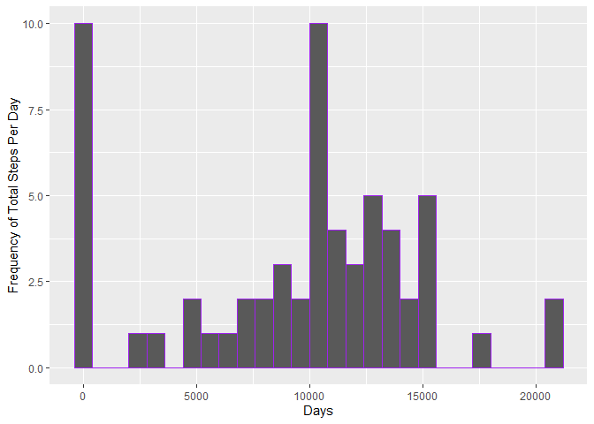
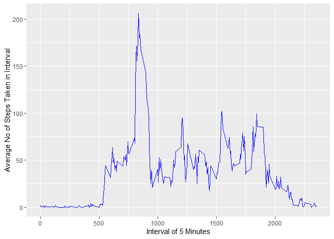
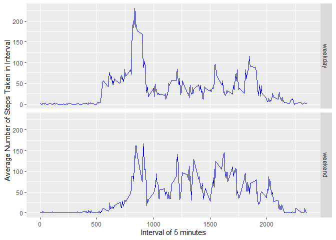

## Loading and preprocessing the data

```r
#Unzipping the compressed file and loading the data
unzip("activity.zip")         
df2 <- read.csv("./activity.csv",na.strings = "NA")
```

## What is mean total number of steps taken per day?

```r
library(ggplot2)  #We use ggplot2 as the plotting library here

stepsvar <- tapply(df2$steps, df2$date, FUN=sum,na.rm=TRUE)
#tapply will sum the steps for every day and assign it to stepsvar 

qplot(stepsvar, binwidth=800, xlab="Days",ylab="Frequency of Total Steps Per Day",colour=I("purple"))
```

<!-- -->

```r
mean_steps <- as.integer(mean(stepsvar))
median_steps <- as.integer(median(stepsvar))
```
The mean and median of total steps per day are 9354 and 10395 respectively.

## What is the average daily activity pattern?

```r
library(ggplot2)
#aggregate function ----> splits data into subsets
#the by values are  --->coerced to factors before use
average_data <- aggregate(x=list(steps=df2$steps), by=list(interval=df2$interval),
                      FUN=mean,na.rm=TRUE)
ggplot(data=average_data, mapping=aes(x=interval, y=steps)) +
    geom_line(colour="blue") +
    xlab("Interval of 5 Minutes") +
    ylab("Average No of Steps Taken in Interval")
```

<!-- -->

### 5 minute interval containing the maximum number of steps averaged across all days

```r
average_data[which.max(average_data$steps),]$interval
```

```
## [1] 835
```

## Imputing missing values

There are a number of days/intervals where the number of steps taken is missing,
they are coded as NA in the original dataset. These missing values may introduce
bias into some calculations or summaries of the data.

### Finding the number of missing values

```r
#the generic function is.na indicates which elements are missing
sum(is.na(df2))
```

```
## [1] 2304
```

We can fill all the missing values with the mean value of that 5 minute interval.


```r
na_fill <- function(steps, interval) {
    mod_df <- NA
    if (!is.na(steps))
        mod_df <- c(steps)
    else
        mod_df <- (average_data[average_data$interval==interval, "steps"])
    return(mod_df)
}
# The function above replaces the NA values with the mean value of that 
# corresponding interval.

new_df <- df2
# We use mapply to apply the function to multiple arguments
new_df$steps <- mapply(na_fill, new_df$steps, new_df$interval)
```
Using the new dataset, we again plot the histogram and find the mean and median  
of the total number of steps taken per day.


```r
#tapply will sum the steps for every day and assign it to stepsvar2 
stepsvar2 <- tapply(new_df$steps, new_df$date, FUN=sum)

qplot(stepsvar2, binwidth=800, xlab="Days",ylab="Frequency of total steps per 
      day",colour=I("green"))
```

<!-- -->

```r
mean_steps2 <- as.integer(mean(stepsvar2))
median_steps2 <- as.integer(median(stepsvar2))
```
The mean and median of total steps per day in the modified histogram are
10766 and  10766 respectively.  

The observation here is that these values differ from those in the first part
of the assignment. The impact of imputing missing data is that both the mean
and median values are higher relatively. This is because instead of using 0
values for the missing data we are using the mean value.

## Are there differences in activity patterns between weekdays and weekends?

For observing this difference, we need to find the day corresponding to 
each date measurement.


```r
# the below function takes a date and outputs either weekend or weekday
# with the help of the weekdays() function in R.
day_helper <- function(date) {
    day <- weekdays(date)
    foo <- c("Monday", "Tuesday", "Wednesday", "Thursday", "Friday")
    bar <- c("Saturday","Sunday")
    if (day %in% foo)
        return("weekday")
    else if (day %in% bar)
        return("weekend")
    else
        stop("invalid date")
}
new_df$date <- as.Date(new_df$date)
# sapply applies the helper function over the date column of our dataframe
new_df$day <- sapply(new_df$date, FUN=day_helper)
```

We make a time series plot of the 5 minute interval and the average number of  
steps taken, averaged across all weekdays and week-end days.

```r
# aggregate function splits the steps day into subset based on type of day
average_data2 <- aggregate(steps ~ interval + day, data=new_df, mean)

# facet grid forms a matrix of panels defined by row nad column faceting variables.
ggplot(average_data2, aes(interval, steps)) + geom_line(colour=I("blue")) + facet_grid(day ~ .) +
    xlab("Interval of 5 minutes")+ ylab("Average Number of Steps Taken in Interval")
```

<!-- -->
